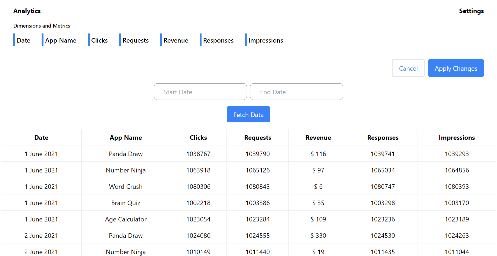
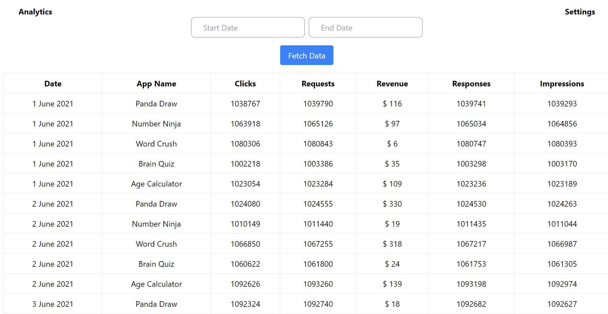

# Flight Reservation App - Pratilipi

Analytics webapp where you can check about the company's detials clicks, request, revenue, response, impressions and many more

## Deployed Link

[Link](https://frontend-assessment-greedygame.vercel.app/)

## Technologies

The project uses the following technologies and frameworks:

- HTML
- CSS
- Javascript
- React.js
- TailwindCSS
- Redux
- React - datepicker

## Installation

Welcome to the Analytics Web App, a powerful tool designed to provide detailed insights into various aspects of your company's performance. With this web application, you can effortlessly track and analyze key metrics, including clicks, requests, revenue, responses, impressions, and much more. Gain valuable insights into your company's operations and make data-driven decisions for continued success.

1. Clone the repository: `https://github.com/ignitinsharma/frontend-assessment-greedygame.git`
2. Install dependencies: `npm install` or `yarn install`.
3. Start the development server: `npm run dev`.

## Screenshots

# Desktop View

